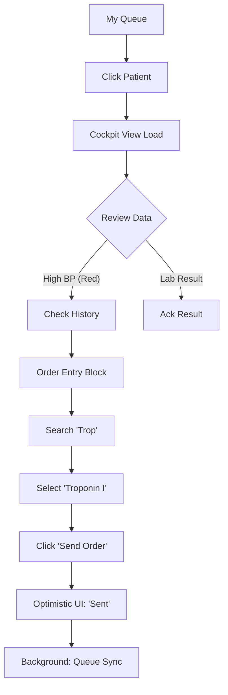
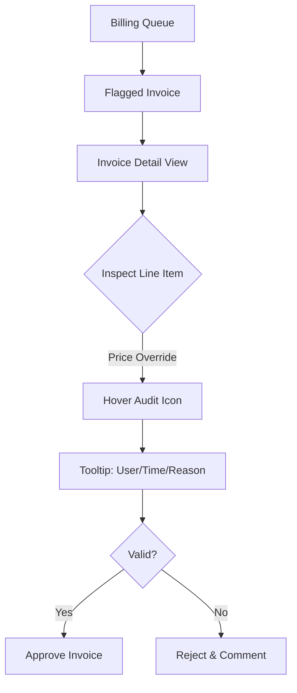

# UX Design Specification: BMADTest

**Author:** Abhijit
**Date:** 2026-01-02

---

## Executive Summary

### Project Vision
BMADTest is a modern, modular Open Source Hospital Management System (HMS) designed to democratize enterprise-grade healthcare technology. The UX vision is centered on "Clinical Reality"—creating a frictionless digital workspace that adapts to the high-stakes, non-linear workflows of clinicians and operational staff. The system prioritizes operational speed, architectural modularity (Internal-as-External), and a "No Dead Ends" philosophy for data capture.

### Target Users
- **Dr. Sarah (Clinician)**: The primary clinical user who requires a unified "Clinical Cockpit" for data-driven decision-making and efficient order entry.
- **Alex (Multi-Role Hybrid)**: A nurse or receptionist who manages patient flow and triage, requiring seamless context-switching between administrative and clinical duties.
- **Marcus (Billing Clerk)**: A financial user focused on the transparency and auditability of the "Clinical Invoice" workflow.
- **Admin/Tech Partner**: Technical users who configure dynamic form templates and manage the distributed "local support economy" around the software.

### Key Design Challenges
- **Role-Aware Context Switching**: Designing a UI mechanism that allows users like Alex to toggle between distinct professional roles (Nurse/Receptionist) instantly, dynamically altering available modules while maintaining patient context.
- **Cognitive Load in the "Cockpit"**: Balancing the presentation of dense clinical data (Vitals, History, Medications, Orders) for Dr. Sarah so that critical alerts are impossible to miss but secondary data is easily accessible.
- **Dynamic Adaptability**: The Triage interface must feel cohesive and structured even as it transforms its input fields based on the selected assessment protocol (e.g., CDC vs. Internal standards).

### Design Opportunities
- **Instantaneous Feedback (Optimistic UI)**: Leveraging Angular/RxJS to provide immediate visual confirmation for CPOE (Order Entry), mitigating the perceived latency of the asynchronous HL7/FHIR message bus.
- **Safety-First Alerting**: Implementing a visual hierarchy that uses subtle yet clear indicators (amber/red highlights) for abnormal patient data, reducing clinical risk through improved situational awareness.

## Core User Experience

### Defining Experience
The heartbeat of BMADTest is the **Clinical Decision Loop**. The system is optimized to make the cycle of "Reviewing Data $\rightarrow$ Documenting Findings $\rightarrow$ Placing Orders" as fluid as possible. Every second saved here translates to better patient care. The design prioritizes data density and speed over white space or simplicity, reflecting the expert nature of its users.

### Platform Strategy
- **Primary Platform**: Desktop/Laptop web browser (Optimized for Google Chrome).
- **Interaction Model**: Mouse and keyboard focused, with extensive support for hotkeys (e.g., `Alt+S` to Save, `Ctrl+Enter` to Submit Order) to speed up data entry for power users.
- **Hardware Agnostic (Phase 1)**: While specialized hardware (printers/scanners) is in the roadmap, the MVP assumes standard OS-level drivers for any printing or scanning needs.

### Effortless Interactions
- **Context-Aware Role Switching**: The role switcher is strategically placed on the **Dashboard only**. This prevents accidental context loss during active patient workflows (like Triage) while making the transition effortless when starting a new task.
- **Visual Signal Processing**: Critical clinical alerts (abnormal vitals, stat results) require zero user interaction to discover. They use "Pre-attentive Attributes" (color, position) to glow/highlight automatically, ensuring safety without clicks.

### Critical Success Moments
- **The "Emergency" Win**: When operational staff can generate a valid MRN and start charting for a critical patient in under 60 seconds using the minimal-data workflow.
- **The "Cockpit" Confidence**: When a clinician opens a patient record and instantly sees the correlation between a high fever (Vitals) and a new Lab Result without navigating away or opening multiple tabs.

### Experience Principles
1.  **Clinical Velocity**: Minimize clicks for the most frequent actions (Ordering, Charting). Speed is a safety feature.
2.  **No Dead Ends**: The UI never blocks a user. If data is missing (e.g., insurance), the system allows "Save as Draft" or "Skip & Flag" to keep the clinical workflow moving.
3.  **High-Fidelity Feedback**: The system provides immediate, optimistic feedback for every action (e.g., "Order Sent") even if the background queue is processing, maintaining the illusion of zero latency.

## Desired Emotional Response

### Primary Emotional Goals
- **Unshakeable Confidence**: Users must feel that the data they see is accurate, current, and has high integrity. In a high-stakes clinical setting, the UI must project stability and precision.
- **Deep Trust**: Through consistent feedback and reliable fallbacks (Optimistic UI + Manual Uploads), the system builds trust. Users should never worry that an order was "lost" in the queue.
- **Radical Simplicity**: Despite the underlying architectural complexity (HL7/Microservices), the user experience must feel lightweight and intuitive. The tech should "disappear," leaving only the clinical workflow.

### Emotional Journey Mapping
- **Initial Discovery**: "Finally, a system that doesn't get in my way." (Relief)
- **Core Clinical Action**: "I have everything I need to make this decision right now." (Empowerment)
- **Task Completion**: "That was faster than paper." (Satisfaction)
- **Error/Latency Event**: "I know exactly what's happening and what to do next." (Calm/Stability)

### Micro-Emotions
- **Confidence vs. Confusion**: Prioritized through clear data labeling and provenance (who/when).
- **Trust vs. Skepticism**: Built via immediate "Order Received" confirmations.
- **Accomplishment vs. Frustration**: Achieved through the "No Dead Ends" policy.

### Design Implications
- **Confidence** $\rightarrow$ High-contrast, legible typography and deterministic layout (elements don't jump around).
- **Trust** $\rightarrow$ Explicit status indicators for the message queue (e.g., "Syncing..." $\rightarrow$ "Synced").
- **Simplicity** $\rightarrow$ Progressive disclosure (show only what's needed for the active role) and meaningful defaults.

### Emotional Design Principles
1.  **Stability as a Feature**: The UI should feel solid. Avoid trendy, "floaty" animations that might project fragility in a medical context.
2.  **Explicit Confirmation**: Never leave the user wondering if a "Save" or "Order" worked. Visual feedback must be immediate and unambiguous.
3.  **Graceful Fallbacks**: When the system encounters a "gap" (e.g., missing insurance), the UI should offer a helpful "manual path" rather than a blocking error message, maintaining the user's calm.

## UX Pattern Analysis & Inspiration

### Inspiring Products Analysis
*   **Microsoft Excel / Google Sheets**: The gold standard for data flexibility. Users love the ability to "just type" and correct mistakes without navigating complex wizards.
    *   *Lesson*: Allow inline editing and "grid views" for bulk data entry (e.g., inventory) rather than forcing a modal for every item.
*   **Windows OS / macOS**: Familiar, windowed multitasking. Users understand "closing a window" or "minimizing a task" intuitively.
    *   *Lesson*: Use a "tabbed" or "panel-based" interface for patient records so a clinician can keep multiple contexts open without losing state.
*   **Notion / Airtable**: Tools that blend structured data with unstructured flexibility.
    *   *Lesson*: For the "Dynamic Assessment Forms," use a block-based editor feel (like Notion) rather than a rigid, hard-coded form.

### Transferable UX Patterns
*   **Inline Edit Grids**: For Inventory and Billing line items, adopt an Excel-like grid where cells are directly editable.
*   **"Draft" States**: Like an email draft or an unsaved Word doc, the system should auto-save partial progress in Triage or Notes without requiring a formal "Submit" action until the end.
*   **Workspace Tabs**: A persistent tab bar (internal to the app) allowing a doctor to have "Patient A (Labs)" and "Patient B (Notes)" open simultaneously.

### Anti-Patterns to Avoid
*   **"The Wizard Tunnel"**: Avoid locking users into multi-step modals that cannot be dismissed without losing data. (The "Linux Expert" trap of rigid processes).
*   **Excessive "Are you sure?"**: Don't nag the user for every small change. Allow "Undo" instead of confirming every action (The "Windows Ease" approach).
*   **Hidden Navigation**: Avoid hamburger menus for primary clinical actions. Top-level navigation should be visible and labeled text, not obscure icons.

### Design Inspiration Strategy
*   **Adopt**: The **Tabbed Workspace** pattern for managing multiple patients/tasks.
*   **Adapt**: The **Excel Grid** pattern, but constrained with clinical validation (e.g., cell turns red if the value is out of range) to blend flexibility with safety.
*   **Avoid**: The **Command Line** complexity. While efficient for experts, it violates the "Windows Ease" principle for rotating staff like Alex.

## Design System Foundation

### 1.1 Design System Choice
**Hybrid System**: **Angular Material** (Component Core) + **Tailwind CSS** (Utility Layout)

### Rationale for Selection
- **Clinical Reliability**: Angular Material provides "Windows-like" ease and reliability via production-ready, accessible components that handle complex clinical data entry (Datepickers, Autocompletes, Steppers) out of the box.
- **Data Density Flexibility**: Tailwind CSS allows us to override the spacious "Material" defaults to achieve the high-density **"Excel-like" grids** required for clinical dashboards, inventory, and billing without fighting a monolithic framework.
- **Angular Integration**: First-party support for Angular ensures high performance in Chrome and seamless state management with RxJS.

### Implementation Approach
- Use **Angular Material CDK** (Component Dev Kit) for complex behaviors like overlays and accessibility.
- Implement **Tailwind CSS** for all structural layouts, spacing, and custom high-density styling.
- Create a set of **"BMAD Design Tokens"** (colors, spacing, typography) that synchronize across both Material and Tailwind to ensure a unified visual language.

### Customization Strategy
- **Density Overrides**: Systematic reduction of padding/margin in Material components to fit more data into the "Cockpit" view.
- **Healthcare Color Palette**: Customized Material theme using a "High Confidence" palette (Blues/Greys) with semantic amber/red for clinical alerts.
- **Excel-Style Directives**: Custom Angular directives to add spreadsheet-like keyboard navigation (arrows, tab, enter) to data grids.

## 2. Core User Experience

### 2.1 Defining Experience
**The "Clinical Cockpit" Review**: The singular moment when a clinician opens a patient record and *instantly* assimilates the full context—History, Triage Vitals, and Active Orders—without navigation. If we nail this "at-a-glance" comprehension, the rest of the system's value follows.

### 2.2 User Mental Model
- **"The Master Chart"**: Clinicians think of the patient record as a single, unified source of truth. They expect it to be dense, stable, and comprehensive, like a well-organized paper chart but searchable.
- **"Excel-Like Read/Write"**: They expect to be able to click any data point (e.g., a weight entry) and correct it immediately, just like a spreadsheet cell, without entering a distinct "Edit Mode."

### 2.3 Success Criteria
- **Zero-Click Context**: All critical data (Vitals, Chief Complaint, Allergies) is visible "above the fold" on load.
- **Pre-Attentive Alerting**: Abnormal values (e.g., High BP) are identified by the user's eye within 200ms via color/weight, requiring no cognitive effort.
- **Latency Perception**: The Dashboard loads in < 2 seconds, feeling "instant" compared to legacy EHRs.

### 2.4 Novel UX Patterns
- **"Block-Based" Clinical Notes**: Adapting the Notion/Airtable pattern to clinical documentation. Instead of a rigid text area, notes are composed of structured blocks (Text, Vitals, Orders) that can be rearranged or templated.
- **"Optimistic" Order Queue**: Visualizing the asynchronous HL7 queue not as a technical loading spinner, but as a "Sending..." $\rightarrow$ "Sent" status badge that doesn't block the user from moving to the next task.

### 2.5 Experience Mechanics
1.  **Initiation**: Dr. Sarah clicks a patient from her "My Queue" list.
2.  **Interaction**: The dashboard opens. She scans the "Vitals Ribbon" (top) and "Timeline" (center). She spots a red-flagged BP. She clicks the "Orders" block to add a new test.
3.  **Feedback**: The system instantly adds the order to the list with a "Syncing" indicator. The Vitals ribbon remains pinned as she scrolls history.
4.  **Completion**: She marks the review as "Ack" (Acknowledged) or adds a Note. The system auto-saves. She hits `Esc` or clicks "Close" to return to her queue.

## Visual Design Foundation

### Color System
**Theme**: "Clinical Confidence" (Blue/Slate)
*   **Primary**: `Slate-900` (Text/Data) & `Blue-600` (Primary Action) - Projects stability and professionalism.
*   **Surface**: `White` (Paper) & `Slate-50` (App Background) - High contrast for readability under harsh clinic lighting.
*   **Semantic Alerts**:
    *   **Critical (Red-600)**: Life-threatening vitals.
    *   **Warning (Amber-500)**: Abnormal but stable.
    *   **Success (Emerald-600)**: "Order Sent" confirmation.
*   **Data Grid**: `Slate-200` borders with alternating row stripes (`Slate-50`) for scannability.

### Typography System
**Font Family**: **Inter** (Neo-Grotesque)
*   **Rationale**: The gold standard for UI interfaces. It has a tall x-height for readability at small sizes (perfect for dense grids) and features tabular figures (essential for aligning vitals/lab data).
*   **Type Scale**:
    *   **Data**: 13px (Dense grids) / 14px (Standard text)
    *   **Labels**: 11px (Uppercase, tracking-wide)
    *   **Headings**: 16px (Section Headers) / 20px (Patient Name) - Kept restrained to save vertical space.

### Spacing & Layout Foundation
**Grid System**: **4px Base Unit** (Compact)
*   **Density Strategy**: Components will use "Compact" sizing by default.
    *   *Input Height*: 32px (vs standard 40px/48px).
    *   *Cell Padding*: 4px vertical, 8px horizontal.
*   **Layout Structure**: A fixed "App Shell" layout (Sidebar + Header + Main Content Area) to provide a stable frame for the dynamic "Cockpit" views.

### Accessibility Considerations
*   **Contrast**: All text must meet WCAG AA (4.5:1) standards against its background.
*   **Color Independence**: Critical alerts (Red/Amber) will also use shape/iconography (e.g., a warning triangle) so colorblind users can distinguish status.

## Design Direction Decision

### Design Directions Explored
We explored several directions focused on balancing data density with clinical safety:
- **The High-Density Grid**: Direct "Excel-like" manipulation of vitals and lab data.
- **The Block-Based Canvas**: Notion-style documentation for clinical notes.
- **The Split-Pane Cockpit**: Pinned context (Vitals) alongside an active work area (Timeline/Orders).
- **The Tabbed Command Center**: Managing multiple patient contexts without state loss.

### Chosen Direction
**Hybrid Cockpit Architecture**: A combination of **Variation 1 (High-Density Grid)** and **Variation 3 (Split-Pane)**, housed within a **Variation 4 (Tabbed)** container.

### Design Rationale
- **Cognitive Efficiency**: The Split-Pane (Variation 3) ensures that Dr. Sarah never loses sight of critical vitals while reviewing history.
- **Speed of Correction**: The High-Density Grid (Variation 1) fulfills the "Ease of Windows" requirement by allowing any data point to be corrected inline without a dedicated edit mode.
- **Context Preservation**: The Tabbed interface (Variation 4) allows Alex and Dr. Sarah to handle interruptions (e.g., a walk-in during a consultation) without losing progress on their current task.

### Implementation Approach
- **Layout**: 3-column "Master-Detail" view. Left: Navigation/Queue; Center: Pinned Context & Timeline; Right: Dynamic Action Block (Notes/Orders).
- **Interaction**: Single-click to focus, double-click to edit (spreadsheet style).
- **Safety**: Semantic "stat-glow" borders on grid cells to highlight abnormal values without cluttering the view with icons.

## User Journey Flows

### Journey 1: The "Multi-Hat" Rapid Triage (Alex)
This flow emphasizes speed during registration but enforcing a deliberate context switch before clinical tasks.

```mermaid
graph TD
    A[Dashboard (Role: Reception)] --> B{Action?}
    B -- Emergency Reg --> C[Modal: Quick Reg]
    C --> D{Submit}
    D -- Success --> E[System: Gen MRN]
    E --> F[Dashboard: Patient Added]
    F --> G{Next Task?}
    G -- Needs Triage --> H[User: Toggle Role -> Nurse]
    H --> I[Dashboard (Role: Nurse)]
    I --> J[Select Patient]
    J --> K[Triage Form: Acute Protocol]
    K --> L[Save Triage]
    L --> M[Dashboard (Patient: High Priority)]
```

### Journey 2: The "Clinical Cockpit" Decision (Dr. Sarah)
Optimized for zero-navigation context gathering and rapid order entry.



### Journey 3: The "Audit Trail" Detective (Marcus)
Focus on transparency and drill-down into financial discrepancies.



### Patterns
- **The "Dashboard Hub"**: All major context switches (Role Change, Patient Selection) happen at the Dashboard level. Once inside a task (Registration, Triage), the user is "locked" into that context until completion or cancellation.
- **"Optimistic" Actions**: Order entry and status updates provide immediate visual feedback ("Sent", "Saved") while the system handles the asynchronous FHIR messaging in the background.

### Flow Optimization Principles
- **Deliberate Mode Switching**: By forcing Alex to return to the Dashboard to switch roles, we prevent "Mode Errors" where he might accidentally enter clinical data while logged as a receptionist.
- **Keyboard-First Registration**: The "Quick Reg" modal is designed to be traversable entirely via `Tab` and `Enter`, satisfying the "Clinical Velocity" principle.

## Component Strategy

### Design System Components
We will leverage **Angular Material** for standard administrative and foundational components:
- **Navigation**: `MatSidenav`, `MatToolbar`, `MatTabs`.
- **Inputs**: `MatAutocomplete` (CPOE search), `MatDatepicker`, `MatSelect`.
- **Containers**: `MatCard`, `MatExpansionPanel` (Historical data grouping).
- **Feedback**: `MatSnackBar` (Optimistic "Order Sent" notifications).

### Custom Components

#### 1. High-Density Data Grid (The "BMAD Grid")
**Purpose**: Fulfills the "Excel Flexibility" requirement for inventory, billing, and vitals.
**Interaction Behavior**:
- **Inline Editing**: Double-click or hit `Enter` on a cell to activate an input field.
- **Spreadsheet Navigation**: Full support for arrow keys to move focus between cells.
- **Stat-Glow Alerts**: Semantic borders (Red/Amber) that activate based on data thresholds without resizing the cell.
- **States**: `Default`, `Focused`, `Editing`, `Invalid`, `Syncing` (Optimistic status).

#### 2. Clinical Block Canvas
**Purpose**: A Notion-style flexible area for clinical documentation.
**Interaction Behavior**:
- **Block-Based**: Notes are composed of discrete blocks (Text, Vitals Snapshot, Order Reference).
- **Drag & Drop**: Ability to reorder blocks within a note.
- **Slash Commands**: Triggering a clinical block (e.g., typing `/vitals`) to pull data into the note.

#### 3. Contextual Role Switcher
**Purpose**: A specialized Dashboard component for the manual профессиональный identity switch.
**Anatomy**: Displays current active role (e.g., "Nurse") with a "Change Role" invitation that opens a selection menu.
**Constraint**: Only interactive when no other patient workflow is active.

#### 4. Patient Pinned Ribbon
**Purpose**: Keeps the most critical patient data (Name, MRN, High-Priority Vitals) visible at all times.
**Anatomy**: A high-density horizontal strip pinned to the top of the "Cockpit" view.

### Component Implementation Strategy
- **Foundation**: All custom components will use **Tailwind CSS** for layout and **Angular Material CDK** for accessibility behaviors (FocusTrap, Overlays).
- **Design Tokens**: Standardized 4px spacing unit and "Clinical Confidence" color palette applied via Tailwind classes.
- **Performance**: Heavy use of `OnPush` change detection and RxJS streams to maintain < 200ms interaction latency in dense grids.

### Implementation Roadmap
- **Phase 1 (Core)**: High-Density Data Grid & Role Switcher (Essential for Alex and Marcus).
- **Phase 2 (Supporting)**: Patient Pinned Ribbon & standard Material form overrides (Essential for Dr. Sarah's Cockpit).
- **Phase 3 (Enhancement)**: Clinical Block Canvas (Optimizes the documentation experience).